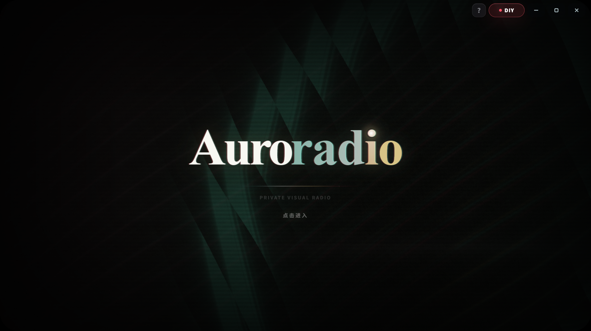

# Auroradio

Auroradio 是一款 Windows 桌面沉浸式音乐播放器，把搜索播放、歌词舞台、粒子视觉、3D 歌单架和完整桌面模式组合成一个更接近现场感的私人音乐空间。

> Auroradio 基于 [XxHuberrr/Mineradio](https://github.com/XxHuberrr/Mineradio)（GPL-3.0）修改而来，感谢原作者的出色设计。原项目的产品表达版权归其作者所有；本项目的修改部分同样以 GPL-3.0 开源。

相对上游的主要修改：

- 集成 lx-music 音源搜索与在线歌单对接（酷我 / 酷狗 / QQ / 网易云 / 咪咕 五平台搜索、歌单广场、歌单链接导入），移植自 [lyswhut/lx-music-desktop](https://github.com/lyswhut/lx-music-desktop) `musicSdk`（Apache-2.0）
- 本项目**不内置任何音源脚本**；kw / mg 等需脚本解析的源，请在软件内自行导入你自己的 lx 自定义音源脚本
- 项目更名与配套品牌调整，服务层代码目录重构（`services/`）

## 演示

<p align="center">
  <a href="./.github/assets/auroradio-demo.mp4">
    
  </a>
</p>

<p align="center">▲ 点击启动画面观看完整演示视频 · <a href="./.github/assets/auroradio-demo.mp4">直接打开视频</a></p>

> 演示视频展示的是新视觉预设的实机效果（音乐广场浏览 + 凤凰预设随乐律动）。

## 亮点与创新

### 🦅 凤凰预设

把 3D 模型解算成数十万量级的粒子点云，在 GPU 上完成骨骼蒙皮与逐粒子驱动——凤凰会随音乐节奏振翅、盘旋与爆羽，而不是播放一段固定动画。粒子视觉与歌词舞台、节拍分析共用同一套时间轴，鼓点落下时凤凰和歌词一起响应。

### 🎪 音乐广场

首页聚合的发现页：每日推荐、平台推荐歌单、继续听、听歌画像和我的歌单入口集中在一屏，配合 3D 歌单架右键唤起，浏览和播放不打断当前的视觉演出。

### 🎧 无需登入，免费听歌

不登录任何平台账号也能搜索并播放五平台（酷我 / 酷狗 / QQ / 网易云 / 咪咕）曲库；配合音源脚本（见下节）可以覆盖需要脚本解析的源。登录账号属于可选增强（同步歌单/高音质），不是听歌的前置条件。

## 音源

Auroradio 不内置、不分发任何具体音源脚本，但内置了 [lx-source](https://github.com/fly-fish76/lx-source) 音源宿主。kw / 咪咕等需要脚本解析的音源按以下步骤启用：

1. 前往 [fly-fish76/lx-source](https://github.com/fly-fish76/lx-source) 获取音源宿主的最新版本与使用说明；
2. 准备你自己的 lx 自定义音源脚本（`.js` 脚本或 `user_api.json` 格式）；
3. 在软件内打开 **设置 → 音源设置**，导入脚本；
4. 导入后即可在搜索、歌单中使用对应音源，无需登录对应平台。

音源脚本由用户自行提供，本项目不对任何第三方音源的可用性与合法性负责。

## 下载

<!-- TODO：发布时填写你自己的发布渠道 -->

| 下载入口 | 说明 | 链接 |
| --- | --- | --- |
| GitHub Release | 安装包与版本说明 | 待发布后填写 |
| 网盘 | 备用线路 | 待发布后填写 |

安装时只需要下载并运行 `Auroradio-x.x.x-Setup.exe`。不要把 `.blockmap`、`latest.yml` 或 `win-unpacked` 当成正式安装包。

### 下载或安装被拦截怎么办

小众 Electron 桌面软件、未签名安装包有时会被浏览器、Windows Defender 或 SmartScreen 提示风险。

1. 浏览器下载栏提示风险时，打开下载列表，点这条下载右侧的 `...` 三个点，选择 `保留` / `仍要保留` / `显示更多` 后继续保留。
2. Windows SmartScreen 弹出蓝色拦截窗口时，点 `更多信息`，再点 `仍要运行`。
3. 如果杀毒软件明确显示木马、高危或已经隔离，不要强行运行；删除该文件后重新从上面入口下载，仍然异常请带截图反馈。

### 从原版 Mineradio 升级

Auroradio 沿用原版的数据目录（`%APPDATA%/Mineradio`）：歌单、播放历史、视觉参数存档和各平台登录态在升级后保留，无需迁移。

## 核心特性

- 首页包含每日推荐、平台推荐、继续听、听歌画像和我的歌单入口
- 五平台音乐搜索（酷我 / 酷狗 / QQ / 网易云 / 咪咕）与在线歌单广场、歌单链接导入
- 完整桌面模式保留播放器、主页、歌单和桌面交互
- 支持本地 MP4 与 Wallpaper Engine 视觉内容
- 播放后切换到 Emily / 默认播放态视觉，歌词舞台与粒子舞台同步工作
- 基于节奏的电影镜头视觉系统
- 面向长播客和 DJ 曲目的专属视觉模式
- 歌词舞台、自定义歌词、歌词位置与视觉控制
- 自定义专辑封面上传与裁剪
- 右键唤起 3D 歌单架，支持歌单队列浏览
- 网易云音乐账号、搜索、歌单、播客等体验接入
- QQ 音乐搜索、登录态与音源补充接入
- 首次启动内置「默认测试」视觉用户存档，软件内默认视觉参数与该存档一致

## 使用说明

正式分发以 `Auroradio-x.x.x-Setup.exe` 为准，不建议直接使用 `win-unpacked` 目录。安装包会创建桌面快捷方式。

## 开发运行

```bash
npm install
npm start
npm run build:win
```

桌面版入口由 Electron 主进程加载本地服务（`server.js` + `services/`）。`npm run build:win` 会生成 Windows NSIS 安装包，产物位于 `dist/`。

## 第三方音乐平台说明

Auroradio 不是网易云音乐、QQ 音乐或腾讯音乐娱乐集团的官方客户端，也不隶属于任何音乐平台。

项目中的第三方平台接入仅用于个人学习、本地客户端体验和用户自有账号的播放辅助。请遵守对应平台的用户协议、版权规则和会员权益规则。项目不会提供绕过付费、绕过会员、破解音质或重新分发音乐内容的能力，也不提供任何内置音源。

## 用户数据与隐私

登录 Cookie、搜索历史、自定义封面、自定义歌词、节奏分析缓存等数据只应保存在本机用户数据目录或浏览器本地存储中，不应提交到仓库。

更多说明见 [PRIVACY.md](./PRIVACY.md)。

## 赞助

如果 Auroradio 陪你多听了一首歌，欢迎请作者喝杯咖啡——完全自愿，不影响任何功能。

<p align="center">
  
  &nbsp;&nbsp;&nbsp;&nbsp;
  
</p>

## 致谢

- [XxHuberrr/Mineradio](https://github.com/XxHuberrr/Mineradio) — Auroradio 的上游项目，粒子视觉、电影镜头系统等核心产品体验由原作者设计与打造
- [lyswhut/lx-music-desktop](https://github.com/lyswhut/lx-music-desktop) — 五平台搜索与歌单对接的代码来源（Apache-2.0）
- emily 作为早期视觉底层想法与 `emily` 视觉预设改进方向的共创者和灵感来源之一，特此感谢
- 同时感谢小天才e宝、应春日、锋将军、軌跡、林中、骊、风痕、花椰菜🥦在早期体验、测试反馈和发布准备中的帮助

## 版权与授权

Copyright (C) 2026 Auroradio contributors.
Copyright (C) 2026 XxHuberrr（上游 Mineradio 原作者）.

本项目采用 GPL-3.0 授权。详见 [LICENSE](./LICENSE)，第三方组件与移植代码的署名见 [NOTICE.md](./NOTICE.md)。

Auroradio 名称与本项目图标为 Auroradio 贡献者所有；原项目 "Mineradio" 名称、MR Logo、界面视觉设计与原创视觉表达归原作者所有；第三方依赖和第三方服务分别遵循其各自授权与服务条款。
